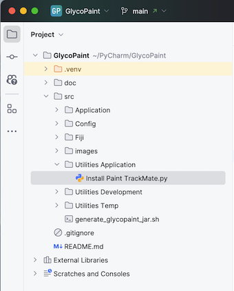

# Installing the Pipeline

The GlycoPaint pipeline is a research application and not developed for a large audience. Installing and running the pipeline is not as easy as for commercial software, and this section provides some support.

### Fiji and TrackMate
The pipeline depends heavily on the image processing software Fiji and the Fiji plug-in TrackMate. To install Fiji, refer to the following website: [https://imagej.net/software/fiji/](https://imagej.net/software/fiji/).
The TrackMate plugin comes pre-configured with the Fiji installation and is available for running under Plugins → Tracking → TrackMate.

Detailed knowledge of Fiji and TrackMate is not required to run the pipeline, but it is recommended to familiarise yourself with the software. Excellent sources are https://imagej.net/learn/fiji/ and https://imagej.net/plugins/trackmate/. 

For a detailed description of TrackMate, refer to the following reference:

> Ershov, D., Phan, M.-S., Pylvänäinen, J. W., Rigaud, S. U., Le Blanc, L., Charles-Orszag, A., … Tinevez, J.-Y. (2022).
TrackMate 7: integrating state-of-the-art segmentation algorithms into tracking pipelines. Nature Methods, 19(7),
829–832. doi:10.1038/s41592-022-01507-1

### Python
The Python scripts were developed in PyCharm, and you can use Pycharm to run them, but any other Python IDE will also work. A free community version from PyCharm can be downloaded from [https://www.jetbrains.com/pycharm/](https://www.jetbrains.com/pycharm/).

The Python scripts are available from the GitHub repository [https://github.com/Leiden-chemical-immunology/GlycoPaint.git](https://github.com/Leiden-chemical-immunology/GlycoPaint.git). Easiest is to clone the repository to your local machine from PyCharm. To do that, you create a new project in PyCharm by selecting 'Project from version control' and entering the repository URL https://github.com/Leiden-chemical-immunology/GlycoPaint.git. A local directory will be created and the code copied. 

You will have to set up a Python interpreter in PyCharm and install some libraries. For setting up the Python interpreter in PyCharm, go to Settings → Project → Python Interpreter. In the top right corner, you can select the interpreter. If you have not set up a virtual environment yet, you can do that here. Select 'Add' and then 'New environment'. Select the base interpreter (e.g., Python 3.13) and select the location of the new environment. The default location is fine. For more instructions, refer to the PyCharm documentation: [Creating a virtual environment](https://www.jetbrains.com/help/pycharm/creating-virtual-environment.html).

With the Python interpreter set up, you can install the required libraries. The 'requirements.txt' file contains the necessary libraries, which will be installed automatically. Manual installation is possible too. In the top right corner of the Python interpreter window, select the '+' icon to add a new library. You can search for the libraries and install them one by one. The version numbers of the libraries are not critical, and different versions are expected to work, but indicate the versions used during development:

- matplotlib (3.10.0)
- numpy (2.2.2)
- pandas (2.2.3)
- pillow (11.1.0)
- scipy (1.15.1)
- nd2reader (3.3.1)

The resulting environment, displayed below, should be able to run the pipeline.

 

### Installing the TrackMate plugin

Fiji has been installed in an earlier step, and per default the TrackMate plugin is available. The GlycoPaint plugin, however, needs to be installed manually. This is done by copying a selection of files to the Fiji/Scripts/GlycoPaint directory. In the Python code hierarchy, in the 'src/Utilities' directory, there is a utility that does that: 'Install Paint TrackMate'.

Running the utility will create the paint.json file in the ~/Paint/Defaults directory if it does not already exist. The utility will then try to establish the path of the Fiji app and copy the necessary files to the plugin directory. If the Fiji path cannot be found, the user can manually supply the correct path in the paint.json file. Rerunning the utility would then cause the files to be copied in the second attempt.  

 

### R Studio
The pipeline also uses R for the data analysis. R Studio can be downloaded from [https://rstudio.com/products/rstudio/download/](https://rstudio.com/products/rstudio/download/). You may have to install R also - instructions to do that are on the site. Examples of R scripts are available from the GitHub repository.

### Install Time
With standard software as PyCharm, Fiji and TrackMate installed, the installation of the pipeline itself should take less than 10 minutes. Installing the standard R language and R Studio is optional and only required if data post-processing is performed with R.

# Available scripts to run the pipeline

With Pycharm installed, the environment set up, and the code cloned from the repository you are ready to run the pipeline. There is a collection of four scripts found in the 'src' directory under 'Application'.

 

- 'Prepare Experiment Info' is run to generate the Experiment Info file.
- 'Generate Squares' is run to do the square processing for individual experiments.
- 'Compile Project' is run to collect information of various experiments into a project.
- 'Recoding Viewer' is run to visually inspect the tracks in recordings of experiments.

The use of these scripts is described in the [Paint Pipeline Documentation](https://rstudio.com/products/rstudio/download/)