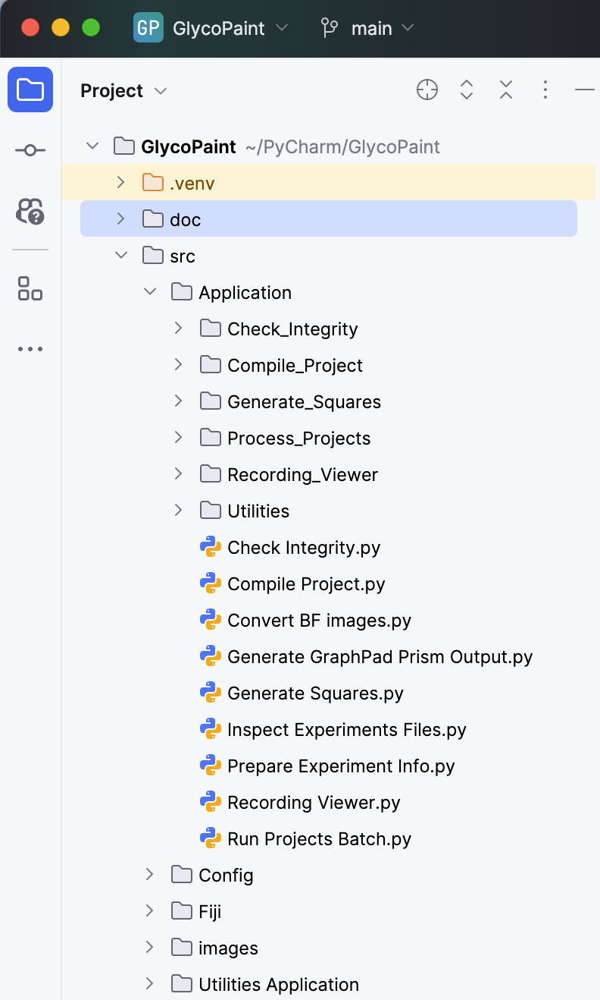

# Installing the Pipeline

The GlycoPaint pipeline is a research application and not developed for a large audience. Consequently, installing and running it requires some support.

### Fiji and TrackMate
The pipeline depends heavily on Fiji and Trackmate. To install Fiji refer to the following website: [https://imagej.net/software/fiji/](https://imagej.net/software/fiji/).
The trackmate plugin comes preconfigured with the Fiji installation and is available for running under Plugins -> Tracking -> Trackmate.

Detailed knowledge of Fiji and Trackmate is not required to run the pipeline, but it is recommended to familiarize yourself with the software. Excellent sourced are available at https://imagej.net/learn/fiji/ and https://imagej.net/plugins/trackmate/. 

For a detailed description of Trackmate, see the following reference:

> Ershov, D., Phan, M.-S., Pylvänäinen, J. W., Rigaud, S. U., Le Blanc, L., Charles-Orszag, A., … Tinevez, J.-Y. (2022).
TrackMate 7: integrating state-of-the-art segmentation algorithms into tracking pipelines. Nature Methods, 19(7),
829–832. doi:10.1038/s41592-022-01507-1

### Python
The Python scripts were developed in PyCharm, and you can use Pycharm to run them, but any Python IDE should work. A free community version from PyCharm can be downloaded from [https://www.jetbrains.com/pycharm/](https://www.jetbrains.com/pycharm/).

The Python scripts are available from the GitHub repository https://github.com/jjabakker/Paint-v8. Easiest is to clone the repository to your local machine from PyCharm. To do that, you select 'Project from version control' and enter the repository URL https://github.com/jjabakker/Paint-v8. A local directory will be created and the code copied. 

You will have to set up a Pyhon interpreter in PyCharm and install the following libraries (the version numbers are not critical, but just indicate the versions used during development):

- matplotlib (3.9.2)
- numpy (2.1.2)
- pandas (2.2.3)
- xattr (1.1.0)
- pillow (10.4.0)
- scipy (1.14.)
- nd2reader (3.3.0)

The resulting environment, displayed below, should be able to run the pipeline.

<figure style="text-align: center;">
  
</figure>

### R Studio
The pipeline also uses R for the data analysis. R Studio can be downloaded from [https://rstudio.com/products/rstudio/download/](https://rstudio.com/products/rstudio/download/). You may have to install R also - instructions to do that are on the site. Examples of R scripts are available from the GitHub repository

# Available scripts to run the pipeline

With Pycharm installed, the environment set up, and the code cloned from the repository, you are ready to run the pipeline. There is a collection of scripts and support files, but for just tunning thr piepline a smnall number if scripts are needed. They are found in the src directory under Applications

<figure style="text-align: center;">
  
</figure>