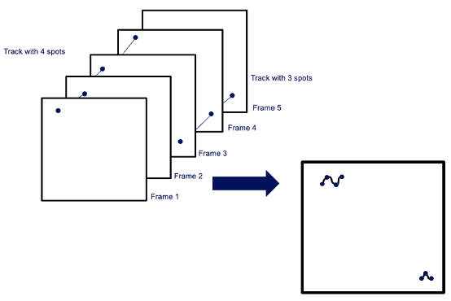
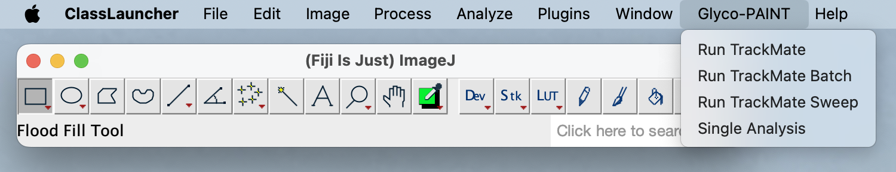
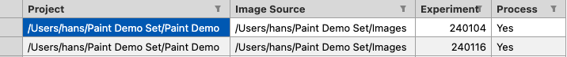

  

<h1 align="center">Glyco-PAINT Application Processing Pipeline</h1>

<h3 align="center">Functional description</h3>

 
 

 
June  2025

 
 

# Introduction

The Glyco-PAINT method and the software are described in: Steuten, K.,  Bakker, J., Doelman, W. et al. Glyco-PAINT-APP: Subcellular analysis of immune cell-lectin binding enables correlation of glycan binding parameters to receptor biology  (doi:https://www.biorxiv.org/content/10.1101/2025.01.24.634682v2 and in [xxxxx].

This manual serves two distinct purposes. Firstly, it provides a comprehensive background on the Glyco-PAINT-Automated Processing Pipeline. Secondly, it introduces a demonstration case to help users familiarise themselves with the pipeline's functionality. Detailed instructions for running the example are provided in [Running the Example](https://github.com/Leiden-chemical-immunology/GlycoPaint/blob/main/doc/Running_the_example.md).

In the Glyco-PAINT method, cells incubated with a fluorescent ligand are imaged using a specialised microscope for 100 seconds, during which 2000 frames are captured. Bright spots - corresponding to stationary (i.e., bound) fluorophores - appear in these frames. These spots represent ligands that have remained immobilised long enough to be detected by the camera and are interpreted as glycans (or other ligands) binding to receptors on the cell surface. Fluorophores may move or disappear shortly after appearing, reflecting unbinding or photobleaching events. A key challenge in this method is distinguishing true biologically relevant binding events from non-specific sticking of fluorophores to the cell surface or coverslip.

**The Glyco-PAINT pipeline** addresses this challenge in two main steps:

###### Spot Detection and Tracking

The Fiji plugin TrackMate detects spots in each frame and records their coordinates. Tracks are created by linking spots across consecutive frames. Each track is characterised by its duration, average x/y position, and distance travelled. If a receptor-ligand pair were completely stationary, it would appear as a series of overlapping spots at the same location. In reality, ligand-receptor complexes typically exhibit slight lateral motion within the membrane, resulting in short,"wriggling" tracks (see illustration). These tracks are typically concentrated on the cell surface and display heterogeneous spatial distributions within individual cells.

 

###### Grid-Based Spatial Analysis

To account for spatial segregation and background signal filtering, a grid, typically 20x20 or 30x30, is overlaid on each recording. This divides the image into 400 or 900 equally sized squares, enabling analysis of spatial differences across regions within a cell or between different cells. Summary statistics, such as event density, dwell time, and diffusion, are computed per grid square.

## Data Structure

In Glyco-PAINT, the primary unit of analysis is the Experiment, rather than an individual recording. An Experiment is a group of recordings acquired under identical conditions, capturing a specific biological phenotype. Data processing of these recordings generates two main output files:

-   All Squares.csv: This file contains summary statistics for each grid square across all recordings in the experiment.
    
-   All Tracks.csv: This file provides detailed tracking information for every individual track in the dataset.

In a typical analysis, as demonstrated in one of the demo experiments, large volumes of data are generated. For instance, each recording produces approximately 800,000 detected spots, resulting in around 50,000 reconstructed tracks. A 20×20 grid across 14 recordings generates 5,600 rows in All Squares.csv, while a 30×30 grid yields 12,600 rows. The corresponding All Tracks.csv file contains approximately 180,000 tracks.

## Design Philosophy

Glyco-PAINT is designed to:

-   Extract the **maximum amount of biologically meaningful information** from large microscopy datasets.
    
-   Ensure **full reproducibility** of results.

-   Require **minimal user intervention.**

-   Be **efficient and scalable** in terms of processing time and computational resources.

# Pipeline Concepts

The Paint Pipeline was developed to analyse (bulk) data from Glyco-PAINT experiments. The interaction of weak-binding ligands to receptors on live cells is studied on various cell types, ligands and adjuvants. Binding events show up as bright spots under a fluorescent microscope. Analysis of the location and duration of spots reveals information about single binding events. Below are listed some crucial concepts and their definition.

**Recording**

Glyco-PAINT's central concept revolves around recording binding events using a fluorescence excitation laser. Each recording is a multi-frame image that captures spots indicative of binding. In our experiments, we observe cells for 100 seconds, capturing 2,000 frames at 50-millisecond intervals.

**Brightfield image**

Each recording is accompanied by a brightfield image that captures the same field-of-view using transmitted white light illumination. This image helps localise cells from the coverslip background. The brightfield image must be named identically to its corresponding recording, with the suffix '-BF'.

**Replicate**

A recording of a specific experimental condition is repeated within the same experiment (date) and usually in the same well of a microscopy slide, but in a different field-of-view.

**Experiment**

A set of recordings and brightfield images is referred to as an experiment. Typically, an experiment is conducted in one day, with up to 100 individual recordings. Generally, several conditions are studied in an experiment, and several replicates are recorded for each condition.

**Project**

A project is a collection of experiments that are analysed together. These experiments may be replicates of earlier ones or introduce new combinations of cell types, probes, or adjuvants.

**Metadata**

Metadata must be provided for recordings for the Glyco-PAINT pipeline to work. Additionally, a simple convention for naming the recordings is used. For instance, from the name '240116-Exp-1-A1-1', the following information can be derived:

- <u>240116</u>-Exp-1-A1-1: Part of experiment 240116
- 240116-Exp-<u>1</u>-A1-1: Operating condition 1
- 240116-Exp-1-<u>A1</u>-1: Microscopic plate well A1
- 240116-Exp-1-A1-<u>1</u>: Replicate 1 with the same experimental conditions
- 240116-Exp-1-A1-1-<u>BF</u>: Filename of the brightfield image corresponding to this recording

# Process Flow

## Overview

 

The Glyco-PAINT process begins with a **microscopy experiment** using a specialised fluorescent microscope to observe binding events. This experiment generates recordings and brightfield images for each experimental condition.

The user then prepares the **Experiment Info** by providing metadata for the recordings. This metadata includes properties such as Cell Type, Probe Type, Concentration, Adjuvant, and necessary processing
parameters.

Next, the experiment data is analysed to detect spots in each frame of the multi-frame set and connect these spots into tracks where appropriate. A track represents a binding event from which kinetic  parameters can be deduced, but background signal filtering is required.

With the tracks available, the **Generate Squares** step overlays a fine grid of squares over each recording, specifying the properties of each square, such as whether it covers an area of interest or background.

Finally, the **Compile Project** combines all data from multiple Experiments into large data tables containing all relevant information, ready for final analysis.

These tables are then used in the **R Analysis** phase to select, process, and present the data in line with research objectives.

The **Recording Viewer** allows users to visually inspect the tracking results, providing feedback on the selection criteria for squares per individual recording. The tracking results are overlaid with the grid and displayed next to the corresponding brightfield image.

All steps will be described in detail in the coming sections, using demo data that can be downloaded from:  

## Prepare Experiment Info

The metadata of an experiment is information about the conditions under which each recording was made. This information is stored in an 'Experiment Info' file. The pipeline contains a 'Prepare Experiment Info' utility that prepares this file. The user provides two parameters: the directory containing the raw data (recordings and brightfield images) and the location of the Paint Experiment directory where the 'Experiment Info.csv' file (and all subsequent data) will be written.

 

After this has been done for both demo experiments, two directories have been created, each with an 'Experiment Info.csv' file.

 

If the file naming convention (as specified above) is used, columns such as Experiment Date, Experiment Name, Condition Nr and Replicate Nr will be filled in automatically. If not, the user must provide this information manually.

 

Below is an example of a fully specified Experiment Info file, containing values for Probe, Probe Type, Cell Type, Adjuvant, and Concentration. The Threshold parameter is required for TrackMate  processing (refer to the next section). The 'Process' flag indicates whether a recording is processed or ignored. You can download copies of these files, [240104 Experiment Info ](https://raw.githubusercontent.com/jjabakker/GlycoPaint-Pipeline/refs/heads/main/Demo/240104%20Experiment%20Info.csv) and [240116 Experiment Info ](https://raw.githubusercontent.com/jjabakker/GlycoPaint-Pipeline/refs/heads/main/Demo/240116%20Experiment%20Info.csv) and save them in their respective directories as 'Experiment Info.csv'.

 

# Run TrackMate

The TrackMate plugin in Fiji analyses recordings, detects spots, and connects them to form tracks where possible. The Experiment Info 'Threshold' parameter determines spot detection sensitivity and is inherited from TrackMate (see the TrackMate manual for a detailed description). A low threshold value detects even poorly defined spots, while a high threshold value ignores poorly defined spots. However, processing takes a long time with more than 1,000,000 spots and doesn't yield usable results for our data and hardware. Therefore, we typically use a value of 5, 10, or 15. For new applications, it's recommended to test spot detection quality using the original TrackMate plugin. To start the 'Run TrackMate' procedure, select the Glyco-PAINT section from the top-level menu and click 'Run TrackMate'.

 

A dialogue box to select the Recordings Directory and Experiment Directory (previously created) is displayed.

 

Upon successful processing (for the demo case, expect roughly 15 minutes runtime), the system has overlaid each recording with tracks as shown below.

 

For the set of recordings in the experiment, the system generates one 'All Tracks' and one 'All Recordings' file with attributes such as Nr Spots, Nr Tracks, Run Time and a Time Stamp. The 'All Tracks' file contains, for every track, the average x and y position, the number of spots and track duration. In addition, the diffusion coefficient for a track is calculated (refer to Algorithms). An example of the first few columns of an All Tracks file is shown below.

 

The Project directory contents just after TrackMate has been run for both the 240104 and 240116 experiments is shown below.

 

In the Glyco-PAINT menu, a second option is listed: 'Run TrackMate Batch'. This option allows multiple projects to be processed without user intervention. For this option, a batch file needs to be provided that should contain exactly 4 columns with the following names:

1.  'Project', specifying the pathname where project data will be saved (analysed data)
    
2.  'Image Source', specifying the pathname where the raw recordings are saved (raw data)
    
3.  'Experiment', specifying the subfolder name of the individual experiment
    
4.  'Process', a Boolean that indicates whether the image is processed or not

 

## Generate Squares

The tracks for the experiment are available in the 'All Tracks' file. The recordings in the Experiment folder (or for all experiments in a Project folder) are analysed by superimposing a grid over the image and determining the characteristics of each square. The user interface for this function is shown below.

 

The number of squares in a row and column determines the size of the squares in the grid (typical values are 20 or 30). The number of tracks for each square is then determined. The 10% least dense squares form a 'background' density, and all square densities are compared to this. If the density ratio exceeds the 'Minimum Required Density Ratio', the square is considered sufficiently distinct from the background to be of interest, otherwise it is ignored. The homogeneity of the squares is also determined, and if requested, the lack of homogeneity (variability) can be limited, excluding squares with too much variability.

For each square that meets the specified density and variability criteria, a histogram of track durations is generated. Tau is then calculated through curve fitting. To ensure accurate curve fitting, a minimum number of data points (tracks) is required. The user can define this threshold with the 'Minimum Tracks to Calculate Tau' parameter.

The quality of curve fitting is expressed in an R2 parameter. An R2 value of 1 indicates a perfect fit, while values lower than 0.5 indicate a low-quality fit. The user-specified 'Min allowable R-squared' parameter sets a limit to the acceptable quality of fit.

For all squares in each recording, several attributes are calculated:

-   Tau and R2 (provided that the squares meet the selection criteria).
-   Density.
-   Diffusion Coefficient.
-   Number of tracks.
-   Duration of the tracks (median, max and total of all, median of 10% longest, median of 10% shortest).
-   Speed (Median and Max of max track speed, Median and Max of mean track speed,

With the 'Generate Squares' function run, the directory structure is shown below (with now additional the All Squares files).

 

## Compile Project

Typically, data to be analysed comes from more than one experiment. With the Compile project option, the data from the experiments in the project are compiled and an [All Recordings](https://raw.githubusercontent.com/jjabakker/GlycoPaint-Pipeline/refs/heads/main/Demo/All%20Recordings.csv), [All Squares](https://raw.githubusercontent.com/jjabakker/GlycoPaint-Pipeline/refs/heads/main/Demo/All%20Squares.csv) and [All Tracks](https://raw.githubusercontent.com/jjabakker/GlycoPaint-Pipeline/refs/heads/main/Demo/All%20Tracks.csv) file, which then comprises all data of the project. Any experiment that starts with a '-' is not included, e.g. '-240116'.

 

 

## Visual Inspection

Once the squares are generated, the results can be reviewed by running the Recording Viewer utility. A straightforward dialogue enables the selection of the Project or Experiment directory.

 

The Viewer dialogue appears, displaying the track reconstruction image on the left with overlaid squares and the corresponding brightfield image on the right. Scroll buttons at the bottom (or the combo box immediately under the 'Squares' window) allow you to select different recordings.

Squares are only shown when they meet specific criteria: density ratio exceeding a minimum, variability less than a maximum, track duration between a minimum and maximum, and the presence of a valid Tau for the square. Pressing the 'v' key also displays squares that meet these criteria but lack a valid Tau.

Below the Squares image, the metadata of the recording in view is displayed. To better view the underlying cells and tracks, keyboard options allow you to toggle between showing squares (key 's') or numbers (key 'n').

 

### Select Recordings

The 'Select Recordings' dialogue enables users to narrow down the recordings they're viewing. For instance, in the provided example, recordings are available for two Cell Types and three Probes. If a user is only interested in BMDC recordings, they can select 'BMDC', click 'Filter', and then 'Apply All Filters' to display only the relevant recordings. The 'Reset' buttons undo a previously made selection, while 'Reset All' undoes all selections previously made.

 

### Select Squares

The Select Squares dialogue allows you to adjust the squares of interest for each recording. Sliders enable you to set the values for Max Allowable Variability, Min Required Density, and Min and Max Longest Track Duration. Squares that no longer meet these criteria will disappear, while those that do will remain visible.

The 'Neighbour' mode limits the spatial distribution of squares. In 'Free' mode, there are no restrictions. In 'Relaxed' mode, squares must touch at least at the corners. In 'Restricted' mode, they must be adjacent along the edges. The 'Set All' button applies the current selection criteria to all open recordings in the project.

The Recording Viewer dialogue offers three options: 'Always Save', 'Never Save', and 'Ask to Save'. These options determine whether changes made in the viewer are saved or not when the user closes the viewer.

 

### Define Cells

In the Define Cells dialogue, you can assign squares to cells. To do this, select a square by drawing a rectangle with the mouse, choose a cell (colour), and press 'Assign'. Any changes you make will be saved
when you exit the Recording Viewer, depending on your chosen save options.

 

### Show Heatmap

The Heatmap dialogue allows you to view the kinetic parameters of squares relative to each other. Five properties are available: Tau, Density, Average Diffusion Coefficient, Longest Track Duration, and Cumulative Track Duration. A colour range of 20 steps is used to display these values. The minimum and maximum values are limited to the current recording unless the 'global' option is checked, in which case they are determined for the current set of recordings. The 'Toggle' function, which can also be invoked by pressing 't', switches between the heatmap and regular display.

Note that for the heatmap values are shown for all squares, i.e., without regard to the selection status.

Whilst the Heatmap dialogue is displayed, the user can scroll through recordings.

 

### Special key bindings

In addition to the interactions that are presented through user interface elements, there are several interactions that are bound to keys.

-   Key 's' toggles the display of squares.
-   Key 'n' toggles the display of label numbers.
-   Key 'v' toggles the display of squares that meet the filtering criteria, but for which no Tau was calculated because the number of tracks is insufficient.
-   Key 'o' writes the currently displayed images to disc (with and without squares). Images are placed in the Output/Squares directory under the Experiment.
-   Key 'p' saves the recordings of the current experiment to disc, with and without squares, in 'png', 'ps' and 'tiff' format. Images are placed in the Output/Squares directory under the Project or Experiment directory.

# Data formats

## All Recordings Format

Holding information on an experiment, two versions of All Recordings are shown. Version 1 displays the contents of All Recordings directly after TrackMate was run, including additional fields beyond the original Experiment Info file. Version 2 shows the contents after Generate Squares has been run. The Tau, Density, and R Squared values relate to those calculated for the entire field of view of the Recording. The kinetic and statistical parameters for individual squares are found in the All Squares file.

|    | Experiment Info   | All Recordings-1     | All Recordings-2           | Comment              |
|:---|:------------------|:----------------------|:---------------------------|:---------------------|
| 1  | Recording Seq. Nr | Recording Seq. Nr     | Recording Sequence Nr      | Factor for selection |
| 2  | Recording Name    | Recording Name        | Recording Name             | Factor for selection |
| 3  | Experiment Date   | Experiment Date       | Experiment Date            | Factor for selection |
| 4  | Experiment Name   | Experiment Name       | Experiment Name            | Factor for selection |
| 5  | Condition Nr      | Condition Nr          | Condition Nr               | Factor for selection |
| 6  | Replicate Nr      | Replicate Nr          | Replicate Nr               | Factor for selection |
| 7  | Probe             | Probe                 | Probe                      | Meta Data            |
| 8  | Probe Type        | Probe Type            | Probe Type                 | Meta Data            |
| 9  | Cell Type         | Cell Type             | Cell Type                  | Meta Data            |
| 10 | Adjuvant          | Adjuvant              | Adjuvant                   | Meta Data            |
| 11 | Concentration     | Concentration         | Concentration              | Meta Data            |
| 12 | Threshold         | Threshold             | Threshold                  | TrackMate            |
| 13 | Process           | Process               | Process                    | TrackMate            |
| 14 |                   | Nr Spots              | Nr Spots                   | TrackMate            |
| 15 |                   | Nr Tracks             | Nr Tracks                  | TrackMate            |
| 16 |                   | Run Time              | Run Time                   | TrackMate            |
| 17 |                   | Ext Rec. Name         | Ext Recording Name         | Factor for selection |
| 18 |                   | Recording Size        | Recording Size             | TrackMate            |
| 19 |                   | Time Stamp            | Time Stamp                 | TrackMate            |
| 20 |                   |                       | Max Frame Gap              | TrackMate            |
| 21 |                   |                       | Gap Closing Max Distance   | TrackMate            |
| 22 |                   |                       | Linking Max Distance       | TrackMate            |
| 23 |                   |                       | Median Filtering           | TrackMate            |
| 24 |                   |                       | Nr Spots in All Tracks     | TrackMate            |
| 25 |                   |                       | Min Tracks for Tau         | User specified       |
| 26 |                   |                       | Min Required R Squared     | User specified       |
| 27 |                   |                       | Nr of Squares in Row       | User specified       |
| 28 |                   |                       | Max Allowable Variability  | User specified       |
| 29 |                   |                       | Min Req. Density Ratio     | User specified       |
| 30 |                   |                       | Exclude                    | User specified       |
| 31 |                   |                       | Neighbour Mode             | User specified       |
| 32 |                   |                       | Tau                        | Calculated           |
| 33 |                   |                       | Density                    | Calculated           |
| 34 |                   |                       | R Squared                  | Calculated           |

## All Squares format

| #   | All Squares                         | Comment                                                                  |
|:----|:------------------------------------|:-------------------------------------------------------------------------|
| 1   | Unique Key                          |                                                                          |
| 2   | Recording Sequence Nr               |                                                                          |
| 3   | Ext Recording Name                  |                                                                          |
| 4   | Experiment Name                     |                                                                          |
| 5   | Experiment Date                     |                                                                          |
| 6   | Condition Nr                        |                                                                          |
| 7   | Replicate Nr                        |                                                                          |
| 8   | Square Nr                           |                                                                          |
| 9   | Probe                               |                                                                          |
| 10  | Probe Type                          |                                                                          |
| 11  | Cell Type                           |                                                                          |
| 12  | Adjuvant                            |                                                                          |
| 13  | Concentration                       |                                                                          |
| 14  | Threshold                           |                                                                          |
| 15  | Row Nr                              |                                                                          |
| 16  | Col Nr                              |                                                                          |
| 17  | Label Nr                            |                                                                          |
| 18  | Cell Id                             |                                                                          |
| 19  | Nr Spots                            |                                                                          |
| 20  | Nr Tracks                           |                                                                          |
| 21  | X0                                  |                                                                          |
| 22  | Y0                                  |                                                                          |
| 23  | X1                                  |                                                                          |
| 24  | Y1                                  |                                                                          |
| 25  | Selected                            |                                                                          |
| 26  | Variability                         | Refer to [Variability](#variability) in Algorithms                       |
| 27  | Density                             | Refer to [Density](#density) in Algorithms                               |
| 28  | Density Ratio                       | Refer to [Density](#density) in Algorithms                               |
| 29  | Tau                                 | Refer to [Tau](#tau) in Algorithms                                       |
| 30  | R Squared                           | Refer to [Tau](#tau) in Algorithms                                       |
| 31  | Median Diffusion Coefficient        | Refer to [Diffusion Coefficient](#diffusion-coefficient) in Algorithms   |
| 32  | Mean Diffusion Coefficient          | Refer to [Diffusion Coefficient](#diffusion-coefficient) in Algorithms   |
| 33  | Median Diffusion Coefficient Ext    | Refer to [Diffusion Coefficient Ext](#diffusion-coefficient-ext)         |
| 34  | Mean Diffusion Coefficient Ext      | Refer to [Diffusion Coefficient Ext](#diffusion-coefficient-ext)         |
| 35  | Median Long Duration Track          | Refer to [Track Duration](#track-duration) in Algorithms                 |
| 36  | Median Short Track Duration         | Refer to [Track Duration](#track-duration) in Algorithms                 |
| 37  | Median Displacement                 | Refer to [Displacement](#displacement) in Algorithms                     |
| 38  | Max Displacement                    | Refer to [Displacement](#displacement) in Algorithms                     |
| 39  | Total Displacement                  | Refer to [Displacement](#displacement) in Algorithms                     |
| 40  | Median Max Speed                    | Refer to [Speed](#speed) in Algorithms                                   |
| 41  | Max Max Speed                       | Refer to [Speed](#speed) in Algorithms                                   |
| 42  | Median Mean Speed                   | Refer to [Speed](#speed) in Algorithms                                   |
| 43  | Max Mean Speed                      | Refer to [Speed](#speed) in Algorithms                                   |
| 44  | Max Track Duration                  | Refer to [Track Duration](#track-duration) in Algorithms                 |
| 45  | Total Track Duration                | Refer to [Track Duration](#track-duration) in Algorithms                 |
| 46  | Median Track Duration               | Refer to [Track Duration](#track-duration) in Algorithms                 |
| 47  | Square Manually Excluded            |                                                                          |
| 48  | Image Excluded                      |                                                                          |

## All Tracks

Holding information on all tracks in a recording

|    | All Squares               |
|----|:--------------------------|
| 1  | Unique Key                |
| 2  | Ext Recording Name        | 
| 3  | Track Id                  |
| 4  | Track Label               |
| 5  | Nr Spots                  |
| 6  | Nr Gaps                   |
| 7  | Longest Gap               |
| 8  | Track Duration            |
| 9  | Track X Location          |
| 10 | Track Y Location          |
| 11 | Track Displacement        |
| 12 | Track Max Speed           |
| 13 | Track Median Speed        |
| 14 | Track Mean Speed          |
| 15 | Track Max Speed           |
| 16 | Track Median Speed        | 
| 17 | Track Mean Speed          |
| 18 | Diffusion Coefficient     | 
| 19 | Diffusion Coefficient Ext |
| 20 | Total Distance            |
| 21 | Confinement Ratio         |
| 22 | Square Nr                 |
| 23 | Label Nr                  |        

# Algorithms

## Tau

Tau is a measure used to characterise the distribution of track durations. To calculate Tau, a frequency distribution is created from the track durations. These durations are then ordered and fitted with a one-phase exponential decay curve to obtain the Tau value.

All tracks within a square are included in the Tau calculation, but it is only performed if a minimum number of tracks is present.

The quality of curve fitting is expressed in an R2 parameter. An   R2 value of 1 indicates a perfect fit, while values lower than 0.5 indicate a low-quality fit. The user-specified 'Min allowable R-squared' parameter sets a limit to the acceptable quality of fit. To calculate one Tau for the entire recording, all tracks within squares that meet the specified selection criteria are considered. These criteria include the minimum required density ratio, maximum allowable variability, minimum and maximum track durations, and neighbour state. These squares are identified by the 'Selected' flag, which is a separate column in all squares.csv.

 

## Variability

The variability of a square calculation begins with overlaying a finer grid over the existing grid and determining the number of tracks in each grid element. The variability is then calculated as the quotient of the standard deviation and the mean of the grid track numbers. The figure below illustrates the variability for four fictional squares.

 

## Density

The Square Density is normalised to duration and concentration and is calculated with the following formula:

$$
Square\ \text{Density} = \frac{\text{Track Cont}}{\text{Area} \cdot \text{Duration} \cdot \text{Concentration}}
$$

The area of a square is calculated with the following data:

$$
Square\ \text{Area} = \left( \frac{0.1602804 \cdot 512}{\text{Nr of Squares in Row}} \right)^2
$$

## Background Density

The background 'density' represents the average track count of the lowest 10% of squares with a track count greater than zero. This measure helps distinguish squares with high track counts, likely on the cell surface, from those on the glass or background.

## Density Ratio

The 'Density Ratio' is calculated by dividing the track count in a square by the background track count per square.

Squares that have a 'Density Ratio' higher than the specified 'Min Required Density Ratio' are considered of interest.

## Diffusion Coefficient

The 'Diffusion Coefficient' is calculated for each track in the recording that contains three or more spots, using the following formula. Here, *n* represents the dimensionality (2), and *t* is the time interval over which displacement is measured (0.05 s).

$$
MSD = \frac{1}{nr\ spots} \sum_{i=1}^{nr\ spots} \left( (x_i - x_0)^2 + (y_i - y_0)^2 \right)
$$

$$
\text{Diffusion Coefficient} = \frac{MSD}{2nt}
$$

The 'Median Diffusion Coefficient' and 'Mean Diffusion Coefficient' values are square attributes and describe, respectively, the median and mean of the 'Diffusion Coefficient Ext' values of all tracks in the square.

## Diffusion Coefficient Ext

The 'Diffusion Coefficient Ext' is a variation on the 'Diffusion Coefficient'. Here, the x and y coordinates of spot (i) are not compared to the first spot (0), but to the previous spot (i-1).

$$
MSD = \frac{1}{nr\ spots} \sum_{i = 1}^{nr\ spots} \left( (x_i - x_{i-1})^2 + (y_i - y_{i-1})^2 \right)
$$

$$
\text{Diffusion Coefficient Ext} = \frac{MSD}{2nt}
$$

The 'Median Diffusion Coefficient Ext' and 'Mean Diffusion Coefficient Ext' values are square attributes and describe, respectively, the median and mean of the 'Diffusion Coefficient' values of all tracks in the square.

## Displacement

The 'Displacement' is the distance between the start and end points of a track. The 'Median, Max and Total Displacement' are, respectively, the median, maximum and sum of the displacements of all tracks within the square. 

## Track Duration

The 'Track Duration' is determined by the number of spots in the track and the time between two frames (50 milliseconds in our experiments).

The median is determined of all the tracks in a square 'Median Track Duration', of the 10% longest tracks in the square 'Median Long Track Duration' and the 10% shortest tracks in the square 'Median Short Track
Duration'.

The 'Max Track Duration' is the longest duration of the track durations in a square, and the 'Total Track Duration' is the sum of all track durations.

## Speed

The speed of a track varies with the distance between consecutive spots, while the time between these spots remains constant. The 'max speed' of a track is the highest recorded speed, and the 'mean speed' is the average speed across all spots.

The 'Median Max Speed' and 'Max Max Speed' are square attributes that represent the median of the maximum speeds of all tracks within a square and the maximum speed of all tracks.

Similarly, the 'Median Mean Speed' and 'Max Mean Speed' are square attributes that capture the median of the maximum speeds of all tracks within a square and the maximum speed of all tracks.

# Parameters

The operation of the Paint Pipeline can be tuned with parameters that
are kept in 'Paint.json' file.

 

The default parameters are suitable for many situations and don't require changing. However, changing parameters requires a deeper understanding of the pipeline and components like TrackMate. In our manuscript, we provide a parameter sensitivity analysis for a selection of tracking and spot detection parameters for our specific use case.

## Paint

Two parameters are of interest: 

-		Image File Extension: Specifies the extension of the images generated by the microscope. For example, for Nikon it is '.nb2'. Generally speaking, any tiff-compatible format is
suitable.

-   Fiji Path: Under normal circumstances, this does not have to be specified, as the software will detect the location of Fiji itself.

## User Directories

In this section, directories previously specified by the user are stored. so they can be offered as defaults in the next component of the pipeline.

## Generate Squares

In this section, parameters are stored that are used by the Generate Squares utility.

-   Five parameters, Nr of Squares in Row, Min Tracks to Calculate Tau, Min Required R Squared, Min Required Density Ratio and Max Allowable Variability, have been entered previously by the user in the
    Generate Squares dialogue and stored so they can be presented in the next invocation of Generate Squares.
    
-   Three other parameters, Neighbour Mode, Min Track Duration and Max Track Duration, provide values that cannot be specified in the user interfaces. The defaults are chosen so that no squares are
    eliminated.
    
-   Fraction of Squares to Determine Background: Specifies the fractionof squares that are used to average the background.

## TrackMate

In this section, parameters are stored that are used by TrackMate. The [TrackMate documentation pages](https://imagej.net/software/fiji/) contain much useful information on TrackMate. Not parameterised, but important choices for TrackMate are the 'LoG detector' model for spotdetection and the 'Simple LAP tracker' model for tracking.

### Spot Detection

The **RADIUS** parameter, used during spot detection, specifies the size of tracked spots. It determines the radius of the detection filter applied to identify objects in the dataset. The value depends on factors like the microscope, recording parameters, and fluorophore used. For Glyco-PAINT experiments, a **RADIUS** of 0.5 micrometres yielded good results.

If positional accuracy is crucial, the **DO_SUBPIXEL_LOCALISATION** parameter enables or disables subpixel spot position refinement. This feature improves object tracking precision, especially with high-resolution data or small objects that don't align perfectly with pixel boundaries. However, Glyco-PAINT doesn't require high accuracy, so the parameter is set to False to avoid unnecessary processing time.

The **DO_MEDIAN_FILTERING** parameter determines whether a median filter should be applied during spot detection. This preprocessing step reduces noise and enhances object detection, especially in noisy datasets. The proposed value is True.

The **TARGET_CHANNEL** parameter specifies the image channel for spot detection in multichannel datasets. This is vital when tracking in only one channel of a dataset (e.g., fluorescence microscopy). For Glyco-PAINT, the parameter defaults to channel 1.

### Building Tracks

TrackMate constructs tracks from spots in subsequent frames. **The LINKING_MAX_DISTANCE** parameter influences the linking phase of tracking. It sets the maximum spatial distance within which two spots in consecutive frames can be linked as part of the same trajectory. If the distance exceeds this limit, TrackMate assumes two separate tracks.

For example, if we expect a lectin to move a limited distance within the cell membrane in subsequent frames (50 milliseconds), a high value for **LINKING_MAX_DISTANCE** is necessary. A suitable value is 0.5 micrometre, which is equal to the expected radius of the spots.

In cases where there are multiple spot candidates for linking to a spot,  the **ALTERNATIVE_LINKING_COST_FACTOR** parameter modifies TrackMate's penalty for alternative connections that are less ideal, such as those that are farther away. The recommended value for this parameter is 1.05.

### Gap Closing

The **MAX_FRAME_GA**P parameter is part of the gap-closing step in the tracking process. It determines the maximum number of consecutive frames an object can disappear for and still be considered part of the same trajectory if it reappears.

Imagine a clearly defined track with spots on proximate positions defined in subsequent frames. However, in some frames, a spot is missing. Do we interpret these as distinct tracks (binding events), or do we assume that the camera simply missed a spot, and this is one long track?

If **ALLOW_GAP_CLOSING** is set to True, TrackMate will consider whether gaps in what may be one track should be closed. If the number of consecutive frames where a spot is missing is smaller than **MAX_FRAME_GAP**, and the distance between the last known and new spot location is smaller than **GAP_CLOSING_MAX_DISTANCE**, the two tracks are interpreted as one track with some spots missing. Otherwise, they are considered separate tracks.

For example, if we expect that a lectin can release a glycan and immediately bind another, a low value of **MAX_FRAME_GA**P is required.

The suggested values for **MAX_FRAME_GAP** and **GAP_CLOSING_MAX_DISTANCE** are 1 frame and 0.5 micrometre, respectively. This is because the expected radius of the spots is 0.5 micrometre.

### Track Splitting

Gap splitting concerns the ability of a track to split into two or more tracks during tracking. This is commonly used in scenarios such as cell division, where a single cell divides into two daughter cells, and branching motion, where a particle splits into multiple trajectories. This is not relevant to the Glyco-PAINT application, and **ALLOW_TRACK_SPLITTING** is set to False.

### Track Merging

Track merging allows two or more tracks to merge into one during tracking. This happens in scenarios like cell aggregation (two cells move together and become indistinguishable) or particle collision (two particles collide and continue as one). However, this is not relevant to the Glyco-PAINT application, so **ALLOW_TRACK_MERGING** is set to False.

### Glyco-PAINT

The **MIN_NR_SPOTS_IN_TRACK** parameter is specific to Glyco-PAINT and, with its default setting of 3, ignores the shortest possible tracks, consisting of only two spots, as they are considered imaging noise.

The **TRACK_COLOURING** parameter determines the track characteristic used for colouring. Valid choices are specified in the TrackMate documentation, and options currently supported are TRACK_ID and TRACK_DURATION.

The **MAX_NR_SPOTS_IN_IMAGE** parameter prevents TrackMate from generating tracks when there are more than the specified number of spots detected. This is because, when there are many spots, tracking becomes prohibitively long, and useful results are unlikely to be achieved. If this situation occurs, processing is aborted, the number of tracks recorded is set to -1, and that recording is excluded from further processing. However, the option remains to process the recording with a higher 'Threshold' parameter (specified in the Experiment Info.csv file).

# Paint directories

The Paint pipeline creates a 'Paint' directory in the user's home directory, with two subdirectories: 'Defaults' and 'Logger'.

-   In the 'Defaults' directory, a 'Paint.json' holds the parameters that are used by the various components of the Paint pipeline. For regular use, parameters do not need to be changed, but the option to change is provided (but requires detailed insight into the pipeline's operation). The parameters are explained in the next section.
    
- In the 'Logger' directory, the system writes log files that provide information about the progress of operations in the pipeline and if any difficulties are encountered. The log files can be statically viewed with a regular text editor or dynamically with the macOS Console application.

  

# Structure of Generate Squares

The core of the data processing takes place in Generate Squares. To facilitate studying the code, some high-level pseudocode is presented here.

**Generate Squares main structure**

    For all the Experiments in the Project (Process Project)
        For all the Recordings in the Experiment (Process Experiment)
            For all the Squares in the Recording (Process Recording)
                Calculate Square properties (Process Square)

**Process Project**

    1. Start project processing and log the project path.
    2. List and sort all experiment directories.
    3. For each directory:
      - Skip if it is not an experiment directory (e.g. if it is an 'Output' directory).
      - Skip if already processed, unless forced by a paint_force flag.
      - Call process_experiment for each unprocessed experiment.
    4. Return the number of experiments processed.

**Process Experiment**

    1. Initialise variables for tracking and logging.
    2. Load track and recording data into DataFrames.
    3. Validate consistency between tracks and recording data
    4. Log the number of recordings to process.
    5. For each recording
       - Retrieve recording details.
       - Call process_recording to process data.
       - Update experiment-level metrics with results from recording.
    6. Save updated tracks, recordings, and squares data to files.
    7. Log total processing time for the experiment.

**Process Recording**

    1. Initialise processing variables.
    2. Loop through all squares in the grid:
       - Calculate square coordinates.
       - Filter tracks within square boundaries.
       - Compute metrics (Tau, Density, Variability, etc.).
       - Append square data to the main DataFrame.
    3. Compute the density ratio for the squares.
    4. Label selected squares and propagate labels to tracks.
    5. Calculate the recording level Tau and Density
    6. Return processed squares, tracks, and recording-level metrics.

**Process Square**

    1. Calculate square boundaries based on grid coordinates.
    2. Filter tracks within the square.
    3. If no tracks:
       - Assign default values for metrics (e.g., Tau, Density = 0).
    4. If tracks exist:
       - Compute metrics (Tau, R-squared, Density, Variability, etc.).
    5. Return a dictionary containing square-level data.
